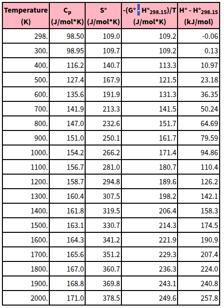

# Energía Disipada en una Solución de Sulfato de Cobre(II) Pentahidratado

## 🔬 Objetivo

Explicar cómo una solución de **CuSO₄·5H₂O** (sulfato de cobre(II) pentahidratado) disipa energía eléctrica en forma de calor cuando se comporta como una **resistencia eléctrica**, y cómo se puede estimar dicha energía usando parámetros físicos y eléctricos.

---

## 🧪 Fundamento Teórico

### 🔌 Efecto Joule

Cuando una corriente eléctrica $ I $ circula por una resistencia $ R $, la energía disipada en forma de calor durante un tiempo $ t $ se calcula como:

$$
E = I^2 \cdot R \cdot t
$$

Esta energía **se transfiere a la solución**, elevando su temperatura.

Donde en el caso de la soluccion esta dado por:

---

[enlace de la capacidad calorífica del Sulfato de Cobre II ](https://webbook.nist.gov/cgi/cbook.cgi?ID=C7758987&Type=JANAFS&Table=on#:~:text=298.98.50%20109.0%20109.2,97).

### 🌡️ Capacidad Calorífica Específica

La **energía necesaria** para elevar la temperatura de una sustancia está dada por:

$$
E = m \cdot c \cdot \Delta T
$$

Donde:

- $ E $: Energía térmica disipada [J]  
- $ m $: Masa de la solución [g]  
- $ c $: Capacidad calorífica específica [J/g·°C]  
- $ \Delta T $: Cambio de temperatura [°C]

---

## 🧾 Datos del Experimento

- **Volumen de solución**: 200 mL  
- **Concentración aproximada**: ~5% p/p de CuSO₄·5H₂O  
- **Resistencia medida**: 50 Ω  
- **Corriente aplicada**: 0.5 A  
- **Duración de la prueba**: 300 s (5 minutos)  
- **Capacidad específica estimada**:  
  - CuSO₄·5H₂O: ≈1.9 J/g·°C  
  - Solución diluida (aproximación): 4.0 J/g·°C  

---

## 🧮 Cálculos

### 1. **Energía disipada (Joule):**

$$
E = (0.5)^2 \cdot 50 \cdot 300 = 3750\ \text{J}
$$

---

### 2. **Temperatura estimada alcanzada:**

Si asumimos 200 g de solución:

$$
\Delta T = \frac{E}{m \cdot c} = \frac{3750}{200 \cdot 4.0} = 4.69^\circ C
$$

---

## ⚡ Conclusión

La energía eléctrica disipada por efecto Joule en una solución de CuSO₄ puede estimarse y relacionarse directamente con el aumento de temperatura de la misma. Este análisis permite comprender **la conversión de energía eléctrica en energía térmica** en sistemas acuosos con sales conductoras.

---

## 📚 Referencias

- NIST Chemistry WebBook (thermochemical data)  
- CRC Handbook of Chemistry and Physics (conductividad)  
- Manuales de Electroquímica Aplicada

